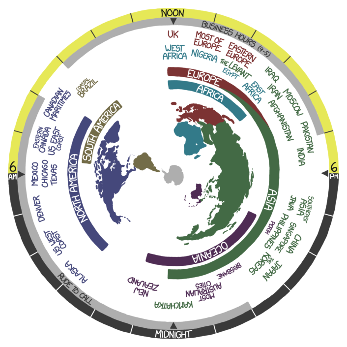
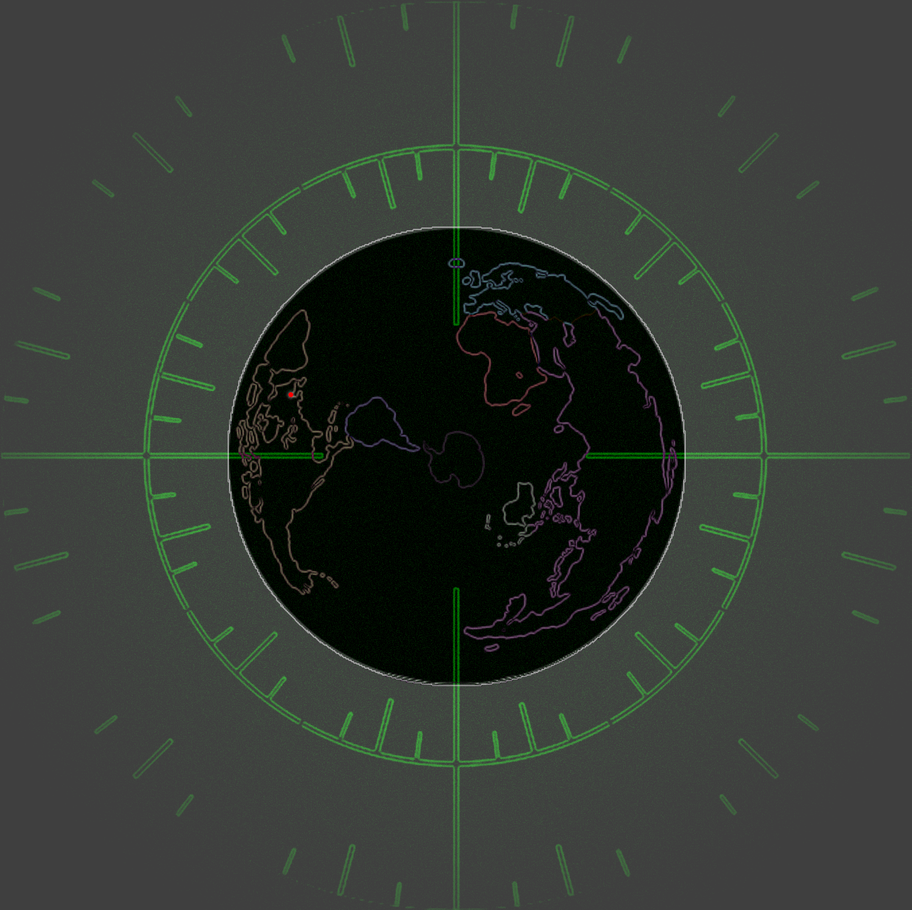

# Randall Clock Desktop Background

**Current Version: 1.0.0**

Change your desktop background using the XKCD "Now" clock or the "dark mode" rendition of it (with green overlay!)

Optionally also put a red dot on the image showing your location.

Special thanks to Randall Munroe and Fred Weinhaus

---

## Example Images

| XKCD Original | Black Green Overlay | Black Green Overlay + Red Dot |
|:-------------:|:------------------:|:-----------------------------:|
|  |  |  |

---

## Project Structure

```
randall-clock-desktop-background/
├── README.md
├── install.sh
├── config.ini
├── requirements.txt
├── posterity.pdf
├── timeupdate.bash
├── xkcdOriginalExample.png
├── blackGreenOverlayExample.png
├── blackGreenOverlayRedDotExample.png
├── src/
│   ├── images/
│   │   ├── masks/                  # Alpha masks for globe extraction
│   │   ├── overlays/               # Stationary overlay images
│   │   ├── intervals15m/           # 15-minute interval image sets
│   │   │   ├── xkcdOriginal/           # Original XKCD frames
│   │   │   └── blackGlobeGreenOverlay/ # Black globe with green overlay
│   │   └── intervals1m/            # 1-minute interval image sets
│   │       ├── blackGreenOverlay/      # 1-minute frames (no red dot)
│   │       └── blackGreenOverlayRedDot/ # 1-minute frames (with red dot)
│   └── scripts/
│       ├── generate-masks.py           # Generate globe masks and overlay
│       ├── generate-frames.py          # Generate 1-minute interval frames
│       ├── red-dot.py                  # Add red dot to frames
│       ├── pick-location.py            # Pick your location for the red dot
│       └── measure-globe.py            # Measure globe center/radius
└── ...
```

### Script Explanations
- **generate-masks.py**: Generates alpha masks for extracting the globe from each 15-minute frame and creates the stationary overlay.
- **generate-frames.py**: Generates 1-minute interval frames by rotating the globe and compositing it with the overlay.
- **red-dot.py**: Adds a red dot to each frame, indicating your chosen location, and rotates it with the globe.
- **pick-location.py**: Lets you interactively pick your location on the globe for the red dot.
- **measure-globe.py**: Lets you measure the center and radius of the globe for accurate dot placement.

---

## Installation

### Quick Install (Recommended)

Run:
```bash
./install.sh
```
This will:
- Check and install dependencies (shows the apt-get command before prompting for sudo)
- Prompt for red dot, location, style, and interval
- Generate overlays, masks, frames, and red dot images as needed
- Set up a cron job for background updates

### Manual Install

1. **Install dependencies:**
   ```bash
   sudo apt-get install feh imagemagick python3 python3-pip python3-tk python3-pil python3-numpy
   pip3 install -r requirements.txt
   ```
2. **Generate images:**
   - Generate masks and overlay:
     ```bash
     python3 src/scripts/generate-masks.py
     ```
   - Generate 1-minute frames:
     ```bash
     python3 src/scripts/generate-frames.py
     ```
   - (Optional) Pick your location for the red dot:
     ```bash
     python3 src/scripts/pick-location.py
     ```
   - (Optional) Measure globe center/radius:
     ```bash
     python3 src/scripts/measure-globe.py
     ```
   - (Optional) Add red dot to frames:
     ```bash
     python3 src/scripts/red-dot.py
     ```
3. **Set up the background update:**
   - Make the update script executable:
     ```bash
     chmod +x timeupdate.bash
   ```
   - Add a cron job:
   ```bash
   crontab -e
     # For 1-minute interval:
     * * * * * /path/to/timeupdate.bash
     # For 15-minute interval:
   */15 * * * * /path/to/timeupdate.bash
   ```

---

## Example `config.ini`

```
[DEFAULT]
image_style = black
interval = 1m
output_dir = src/images/intervals1m/blackGreenOverlay
mask_dir = src/images/masks
overlay_dir = src/images/overlays
RedDot = 1

[LOCATION]
x = 631
y = 857
mode = black

[BLACK_GLOBE]
center_x = 960
center_y = 960
radius = 900
width = 1920
height = 1920

[XKCD_GLOBE]
center_x = 480
center_y = 480
radius = 450
width = 960
height = 960
```

- **image_style**: The style of images to use for the clock (`black` or `xkcd`).
- **interval**: The interval for background updates (`1m` or `15m`).
- **output_dir**: Where generated frames are saved.
- **mask_dir**: Where alpha masks are stored.
- **overlay_dir**: Where overlay images are stored.
- **RedDot**: 1 to enable the red dot, 0 to disable.
- **[LOCATION]**: Your picked coordinates and style.
- **[BLACK_GLOBE]/[XKCD_GLOBE]**: Globe measurement data for accurate dot placement.

---

## Troubleshooting

- Make sure all dependencies are installed (see above).
- If the background is not updating:
  1. Make sure `feh` is installed
2. Check if the script is executable
  3. Verify your display is set correctly (e.g., `DISPLAY=:0`)
4. Check cron logs: `grep CRON /var/log/syslog`
- If you have issues with the red dot or image generation, check the output directories and rerun the relevant scripts with overwrite enabled.

---

## Credits

- XKCD "Now" clock: [xkcd.com/1335](https://xkcd.com/1335)
- Explanation: [explainxkcd.com/1335](https://explainxkcd.com/1335)
- Black globe version and batch image processing: [Fred Weinhaus's ImageMagick scripts](http://www.fmwconcepts.com/imagemagick/index.php)

## Black Mode
This mode displays a black background with a green overlay showing the current time. The clock is viewed from the south pole and uses a 24-hour dial. The time display is calibrated with a fixed offset to ensure correct time alignment regardless of installation time.

## Black Mode Globe Workflow

The black mode globe is generated in two phases:

1. **Installation Phase**  
   During installation (via `install_blackmode.sh`), a base globe image is created with the red dot already placed on it. This is done using the `--create-base` flag along with the `--dot-x` and `--dot-y` coordinates. The resulting image is saved as `base_globe_with_dot.png`.

2. **Update Phase**  
   During updates (via `update_background.sh`), the pre-created `base_globe_with_dot.png` is used as the base image. Since the red dot is already part of the base image, the update process does not add a new dot. Therefore, the update script sets `use_red_dot` to `False`, and `dot_x` and `dot_y` are `None`. The workflow is as follows:
   - **Installation**: Create base globe with red dot → save as `base_globe_with_dot.png`
   - **Updates**: Use `base_globe_with_dot.png` → rotate it → update background
